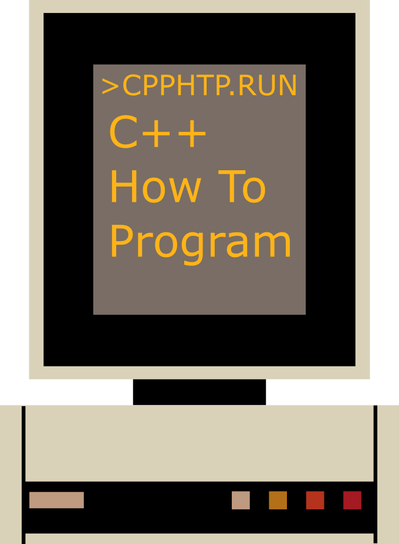

## Overview
Source code written during the learning path of [C++ How to Program][HTP]
book; an overview of the build environment for the *AppVeyor* continuous
integration service can be viewed on this [page][APPVEYOR].

| Operating System | OS Version       | Targeted Toolchain | Build Status |
|:---------------- |:----------------:|:------------------ |:------------:|
| Ubuntu           | Rolling (x64)    | GCC                | [](https://circleci.com/gh/jhxie/CPlusPlusHowToProgram) |
| Windows          | 10 (x64)         | Visual Studio 2017 | [](https://ci.appveyor.com/project/jhxie/cplusplushowtoprogram) |

## Dependencies
* C++ Compiler with ISO C++ 14 Support (Clang **3.5** / GCC **6.1** / Visual C++ **19.14**)
* [Boost][BST] Library (**1.62**)
* [CMake][CMK] Build System (**3.4.3**)
* [GraphViz][GVZ] Graph Visualization Software (**2.38**)

As of this writing only the *Boost Multiprecision Library* is used from the Boost
suite; note the library getting used in this code base is considered
header-only.

*GraphViz* is optional during the build process; however, the diagrams listed
under the [doc](doc/) subdirectory would not be rendered and written to
*build* subdirectory if all the layout engine executables of *GraphViz* cannot be
found; refer to the custom *CMake* module
[FindGraphViz](cmake/modules/FindGraphViz.cmake) for further details.

**Ubuntu** (Docker Tag: rolling)  
Unfortunately there is no separate *Boost Multiprecision Library* available in
the official package archive, so a full installation becomes mandatory:
```bash
sudo apt-get install build-essential cmake cmake-extras extra-cmake-modules graphviz libboost-all-dev
```

**Windows** (10)  
Follow the [documentation][VS2017] listed to install *Visual Studio*, make sure
workloads *Windows desktop development with C++* and
*Linux development with C++* are installed.

To install *Boost Multiprecision Library* and make it easily discoverable by the
relevant **CMake** *find_package* call, try to use [Visual C++ Packaging Tool][VCPKG]
; it works like a Windows equivalent of **FreeBSD** *Ports System*.
After it is properly installed and add its directory to the system **PATH**
environment variable (follow the guide below as it works similarly), issue the
following command to install *Boost Multiprecision Library*:
```
vcpkg install boost-multiprecision:x64-windows
```
Lastly proceed to install *GraphViz* from the address shown
[here](https://graphviz.gitlab.io/_pages/Download/Download_windows.html).

After installing it, add all the command line layout engine executables to the
system **PATH** environment variable:
```
Copy the Installation Path Contains the 'dot' Executable ('bin' subdirectory)
Run Dialogue (Windows Key + R) → sysdm.cpl → OK
Advanced → Environment Variables → Select 'Path' in the List → Edit
New → Paste the Absolute Path that Contains the 'dot' Executable → OK
```
## Build Instructions
The included diagrams for documentation purposes would be rendered in *PNG*
format and reside in *doc* subdirectory of the *build* directory.

**Ubuntu** (Docker Tag: rolling)  
Change working directory to where the source directory resides and then issue:
```bash
mkdir build
pushd !$
cmake .. && make -j$(nproc)
```

**Windows** (10)  
If Visual Studio 2017 is installed, the project can be directly imported into
the *IDE* without generating solution or project files by following the
following steps:
```
File → Open → CMake → Navigate to the Source Directory → CMakeLists.txt
```
After it is imported, consider editing the *CMakeSettings.json* file to make the
two CMake cache entry definitions **CMAKE_TOOLCHAIN_FILE** point to the correct
files; lastly build the project by issuing:
```
Project Settings → x64-Debug
CMake → Build All
```
It should use *Ninja* as a back-end during the building process.

To import the project with conventional solution file, first make sure
*CMake* is properly installed, then issue the following in *PowerShell* after
changing the working directory to where the source directory resides:
```
(mkdir build) -and (pushd build)
cmake ..
```
A Visual Studio solution file (*CPlusPlusHowToProgram.sln*) that matches the
installed version of the *IDE* should be generated inside *build* sub-directory;
simply open this file and build it with the *IDE* as usual.

## Getting Started
**Ubuntu** (Docker Tag: rolling)  
To run the compiled executables, issue commands similar to the following
(assume the current working directory is *build*):
```bash
pushd src
2/CInAndCOut
```
All the executables should be easily accessible in this directory; once the
debugging or experimenting session has ended, issue the following to get back
to the original directory:
```bash
cd -2
```

**Windows** (10)  
If Visual Studio 2017 is being used, right click the translation unit that
needs to be executed in *Solution Explorer* and select *Debug*. Otherwise, follow
the usual debug instructions as it requires in the relevant version.

## Credits
* The [DownloadProject][DOWNPRO] *CMake* module is used to download and
statically link [Google Test][GTEST] at project configure time.
* The computer that appears on the *C++ How To Program* banner is loosely modeled
after an Xerox [Alto][ALTO] with *InkScape*.

## License
Copyright © 2017 - 2018 Jiahui Xie  
Licensed under the [BSD 2-Clause License][BSD2].  
Distributed under the [BSD 2-Clause License][BSD2].  

[ALTO]: https://en.wikipedia.org/wiki/Xerox_Alto
[APPVEYOR]: https://www.appveyor.com/docs/build-environment/
[BSD2]: https://opensource.org/licenses/BSD-2-Clause
[BST]: https://www.boost.org/
[CMK]: https://cmake.org/
[CMAKEGENERATORS]: https://cmake.org/cmake/help/git-master/manual/cmake-generators.7.html
[DOWNPRO]: https://github.com/Crascit/DownloadProject
[HTP]: https://www.deitel.com/books/cpphtp10
[GTEST]: https://github.com/google/googletest
[GVZ]: https://graphviz.org/
[VCPKG]: https://github.com/Microsoft/vcpkg
[VS2017]: https://docs.microsoft.com/en-us/visualstudio/install/install-visual-studio
