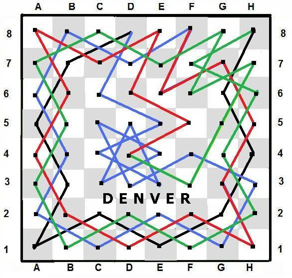
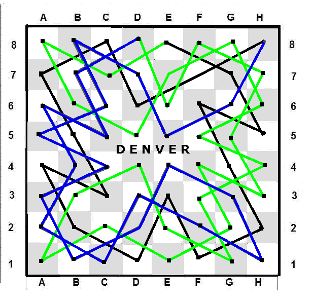

# Knight's Tour Exercise (*7-22*)
This exercise consists of four parts; only the latter three parts are shown.

# Part B
*Tour A* starts at *D8*, *F8*, or *H8*.



*Tour B* starts at *D8*, *E8*, or *H8*.



The following are the two sample tours in *ASCII* output:

* [KnightsTourDirectionsA](./KnightsTourDirectionsA.txt)
* [KnightsTourDirectionsB](./KnightsTourDirectionsB.txt)

To show usage information on [7-22-B](./7-22-B.cpp):
```
7-22-B -h
```

## Credits
The two sample tours are given by *Denver* on this [site][KNT].

[KNT]: https://www.chess.com/chessopedia/view/knights-tour
